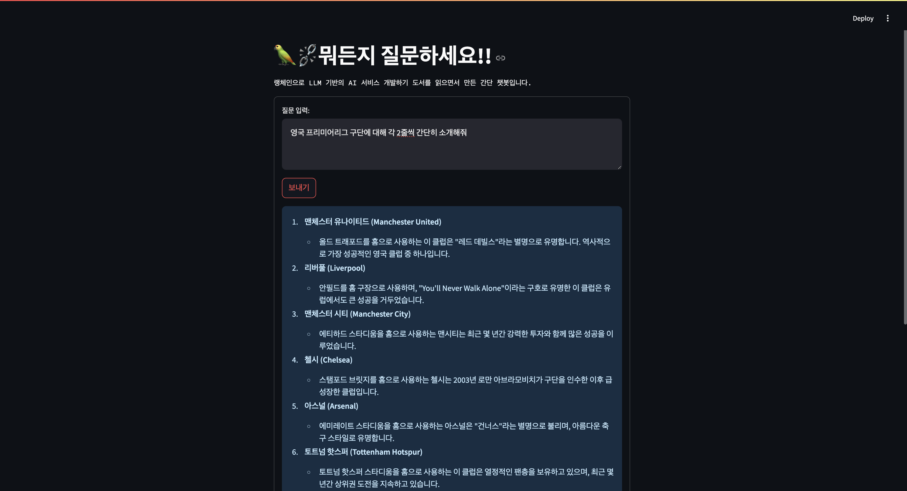
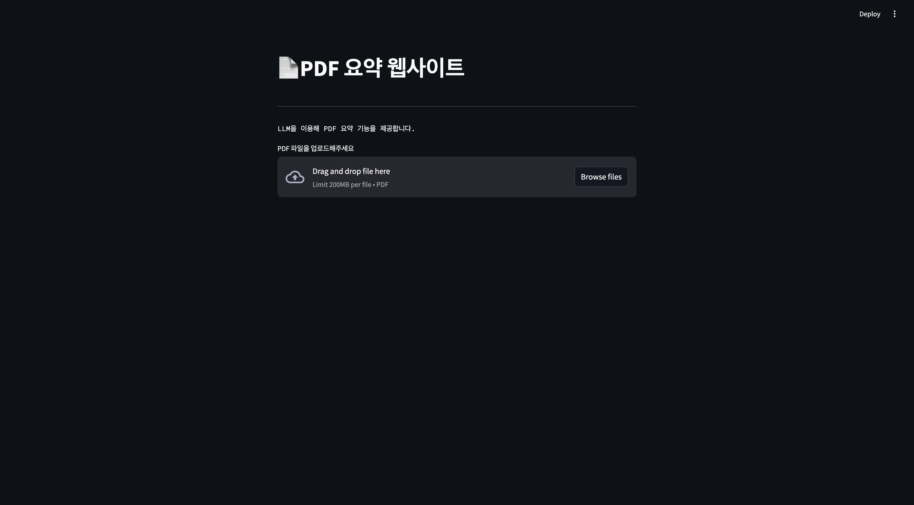
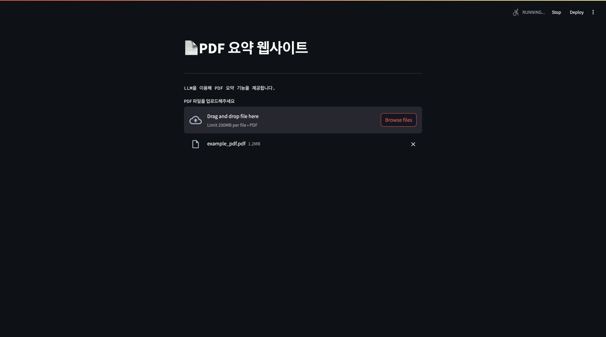
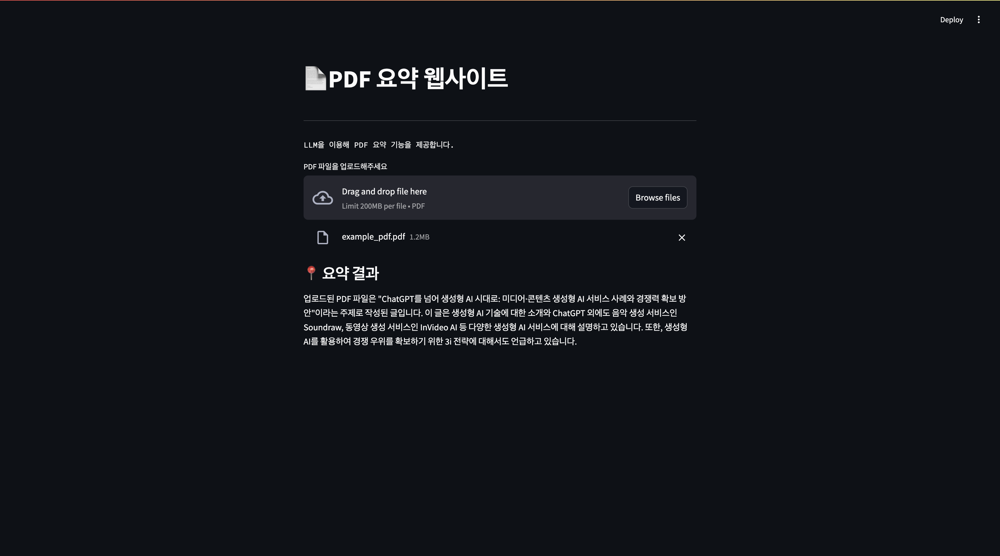
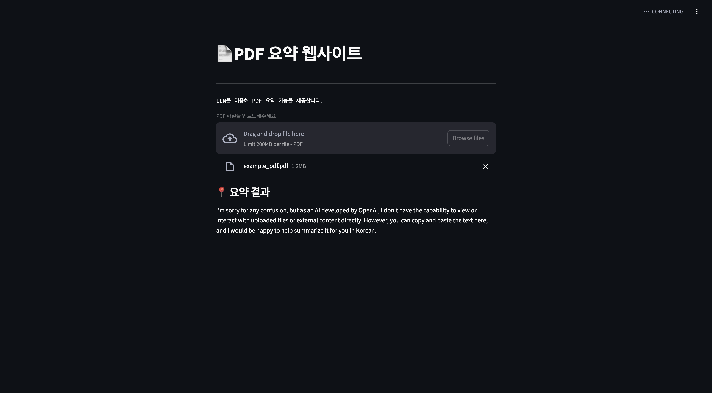
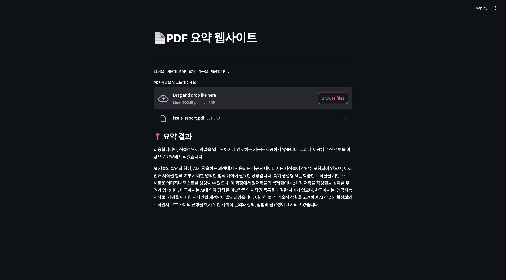

# langchain_study_basic
🌼 Langchain 공부 내용 기록 repository

### 📍 교재 및 사이트 
- 주교재
    - 랭체인으로 LLM 기반의 AI 서비스 개발하기
- 참고 사이트
    - [Langchain api reference ](https://api.python.langchain.com/en/latest/langchain_api_reference.html)
    - [Wikidocs Langchain 한국어 튜토리얼](https://wikidocs.net/book/14314)
    - [Langchain v0.2](https://python.langchain.com/v0.2/docs/versions/v0_2/)

### 📍 간단한 챗봇 웹사이트 
- 파일명 : **ch5_1_simple_chatbot.ipynb**
- 라이브러리 
    - langchain
    - streamlit
    - openai
- 언어 모델 : gpt-4-turbo
- streamlit 이용해 웹사이트 아주 간단하게! 제작
- 챗봇 사용 방법
    - 개인 Open AI 키를 .env 파일에 저장하기 
    - 깃허브에서 다운로드 받은 파일을 주피터 노트북에서 켜서 File > Save and Export notebook as > Executable Script로 파일 다운받기 → .py 파일이 다운받아질 것임 
    - 터미널에서 .env랑 .py 파일을 같은 경로에 두고 'streamlit run 파일명.py'로 실행하면 웹사이트로 들어가짐 
    - 단, streamlit pip 설치되어 있어야 함 (pip install streamlit)

**직접 실행한 결과 이미지**

### 📍 PDF 요약 웹사이트 
- 파일명 :**ch_5_3_PDFsummarywebsite.ipynb**
- 라이브러리
    - langchain
    - streamlit
    - PyPDF2
    - langchain_huggingface
- 언어 모델 : gpt-3.5-turbo-16k
- 벡터 데이터베이스 : FAISS
- 임베딩 모델 : HuggingFaceEmbeddings(model_name="sentence-transformers/all-MiniLM-L6-v2"
)

**직접 실행한 결과 이미지**
1. 첫 화면

2. pdf 파일 업로드 

3. 요약 결과 확인 

**오류났었던 부분 기록**
> 파일을 업로드하면 요약 결과 부분에 다음 사진에 있는 내용만 나오고 제대로 요약하지 못함

- 해결 시도 
    1. 사진 속 내용이 PDF 파일을 그대로 줘서 요약하지 못한다는 내용 같아 코드를 다시 봤는데 분명히 PyPDF2를 이용해 pdf 파일의 텍스트를 뽑아 chunk로 분할하고 임베딩 변환을 수행했다. 
    2. **모델 변경** : 모델을 gpt-4-turbo를 썼는데 이 부분이 혹시 잘못되었나 싶어 gpt-3-turbo-16k로 했는데 제대로 동작함!!!

👉🏻 아마 모델의 자체 제공 기능과 맞지 않거나 모델과 사용한 함수나 라이브러리 간 호환성이 맞지 않았던 것 같다. gpt-4-turbo-preview로 실험한 결과, gpt-4-turbo와 같이 아예 안되지는 않았지만, 요약은 해주나 다음과 같은 문장이 나왔다. 
